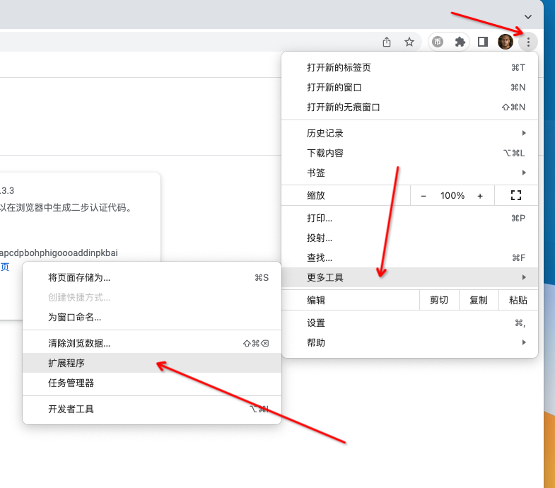

# 自动投币机

> 一天投完全部硬币！！

- Bilibili演示视频：https://www.bilibili.com/video/BV1ZL4y15776/
- 详细说明：https://mp.weixin.qq.com/s/mYD76WFJzkqokaJ12KYbpQ

## 怎么使用？？

这个就是一个非常简单的**Chrome 浏览器插件**，核心怎么导入插件即可

1. 下载代码（_如果下载下来是个压缩文件，记得解压_）
2. 打开Chrome浏览器，点右上角3个点，如下图，进入**扩展程序**，也可以直接在浏览器中输入`chrome://extensions/`来访问：
3. 打开右上角**开发者模式**，这样就会有**加载已解压的扩展程序**按钮：
4. 点击**加载已解压的扩展程序**按钮，选择之前的代码目录，这样，就可以在列表中看到**自动投币机**了
5. 访问[B站](https://www.bilibili.com)，可以看到左上角有一块丑的UI，点击开始即可开始投币：

## 核心代码逻辑？

都在`js/content.js`里面了，很简单
